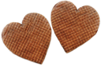

| Emoji | Name | Source |
|-------|------|--------|
|  | ace-heart | Unknown |
|  | agender-heart | Unknown |
|  | aro-heart | Unknown |
|  | bi-heart | Unknown |
|  | demiboy-heart | Unknown |
|  | demigirl-heart | Unknown |
|  | enby-heart | Unknown |
|  | genderfluid-heart | Unknown |
|  | genderqueer-heart | Unknown |
|  | heartish | Unknown |
|  | intersex-heart | Unknown |
|  | leather-heart | Unknown |
|  | lesbian-heart | Unknown |
|  | neutrois-heart | Unknown |
|  | pan-heart | Unknown |
|  | pride-heart | Unknown |
|  | rainbow-heart | Unknown |
|  | straight-ally-heart | Unknown |
|  | stroop-hearts | Unknown |
|  | trans-heart | Unknown |

If you have more or know the sources of any of these, please raise against the [GitHub repo](https://github.com/wheresalice/pridehearts).